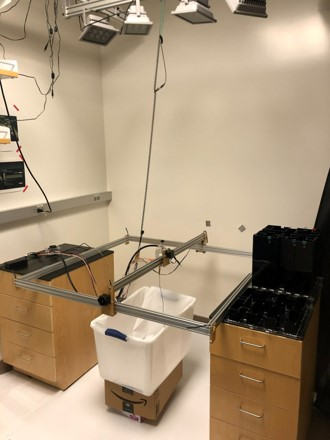
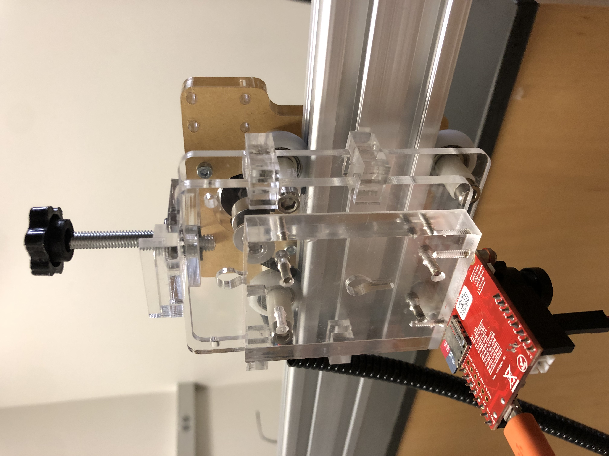
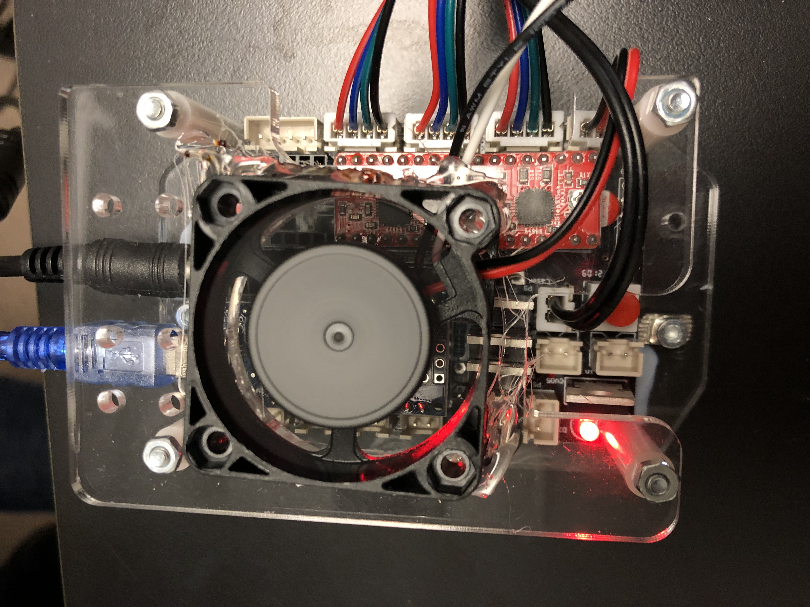
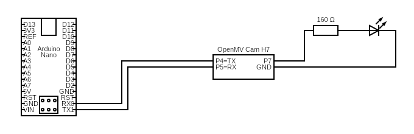

# mouse-tracker

## Quick start

### System design:

  
  
  

circuit diagram software: https://www.circuit-diagram.org/editor/

### Setup:
The `setup` folder serves as a incremental guide for users who want to replicate our system.
- `detect.py`: use OpenMV camera to detect blobs.
- `computer_to_grbl.py`: send G-code to gantry from computer.
- `OMV_to_grbl.py`: send G-code to gantry from OpenMV camera.

### PID control:
Run `PID_control.py` in OpenMV IDE. 

## References:
Rosenberg, M., Zhang, T., Perona, P., and Meister, M. (2021). Mice in a labyrinth exhibit rapid learning, sudden insight, and efficient exploration. ELife 10, e66175. (https://doi.org/10.7554/eLife.66175)
https://github.com/markusmeister/Rosenberg-2021-Repository
